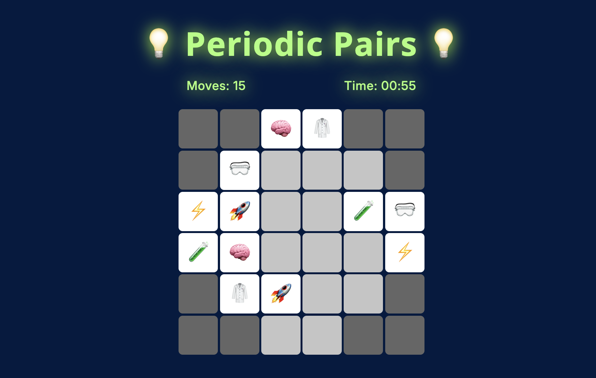
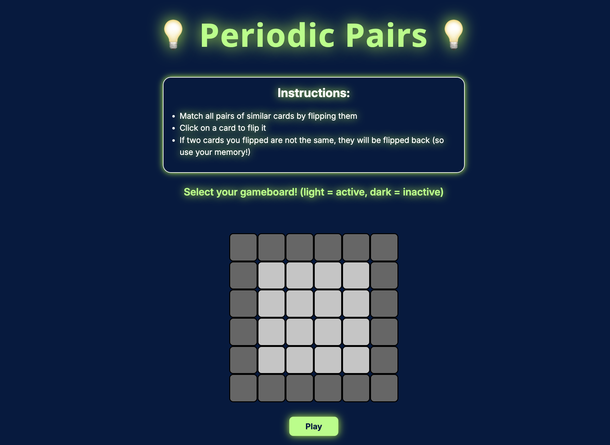
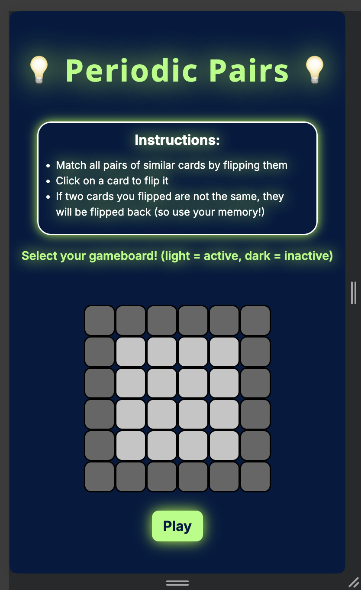
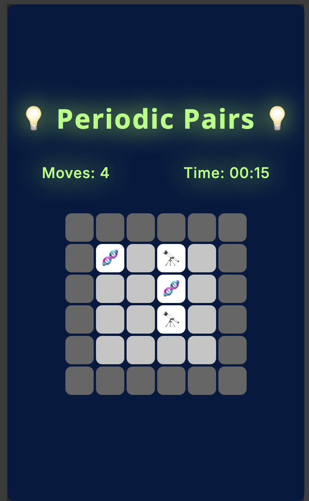
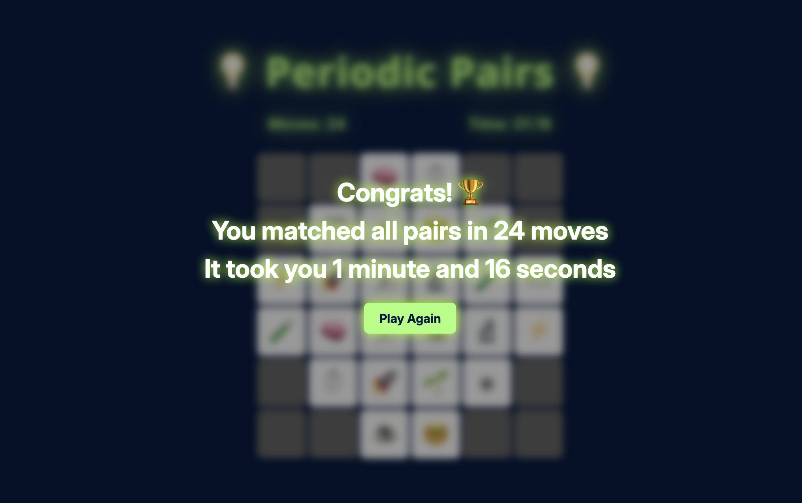

# Periodic Pairs

This is a simple matching game for science-type icons! The twist is that YOU design your own gameboard!

Game **available** at **https://hishambhatti.github.io/periodic-pairs**

## Motivation

I graduated from UW a few months ago never having taken a frontend course or exploring frontend development in any capacity. However, I have always been interested in frontend as its the key to unlocking amazing user experiences.

I followed a tutorial to learn HTML, CSS, and Javascript. To put these skills to use, I created this game! Yes, everything in this was **raw frontend**. No frameworks, no libraries.

## Instructions

* Match all pairs of similar cards by flipping them
* Click on a card to flip it
* If two cards you flipped are not the same, they will be flipped back (so use your memory!)
* Select your gameboard by clicking on the cards you want to be available

## Gameplay

This game is compatible for any screen size (mobile, desktop, tablet, etc.)

#### Title Screen

|  |  |
| :---: | :---: |

#### Game Screen

|  |  |
| :---: | :---: |

#### Win Screen

## Credits

* VectorStatic: https://github.com/VectorStatic/Memory-Matching-Game
* Google Fonts: Inter
* Jamezmca HTML-CSS Full Coure: https://github.com/jamezmca/html-css-full-course
